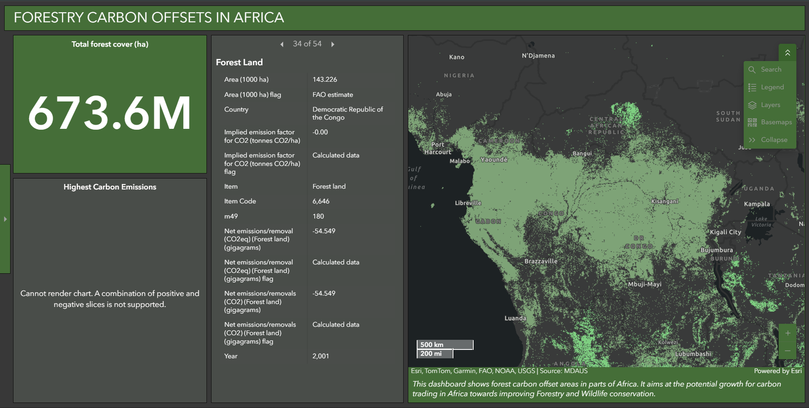

# Forestry Carbon Offsets in Africa Dashboard



This repository contains a  version of the "Forestry Carbon Offsets in Africa" dashboard, originally created using ArcGIS Dashboards. The original dashboard, accessible at [https://www.arcgis.com/apps/dashboards/b5643ccc67f14c0b8ade84701720ba25](https://www.arcgis.com/apps/dashboards/b5643ccc67f14c0b8ade84701720ba25), was developed by Katongole Umar Geoyouthmappers (Same Author), Uganda, to showcase forest carbon offset areas in Africa, with a focus on improving forestry and wildlife conservation.

This code is built using raw HTML, CSS, and JavaScript, leveraging the ArcGIS API for JavaScript to recreate the map and widgets. It is designed to be hosted on GitHub Pages or any static web server.

## Features

- **Interactive Map**: Displays forest cover data in Africa with zoom, pan, and search capabilities.
- **Sidebar Indicators**: Shows total forest cover (673.6M ha) and detailed forest land statistics for Africa.
- **Widgets**: Includes Search, Legend, Layer List, Basemap Gallery, and Scale Bar for map interaction.
- **Responsive Design**: Matches the dark theme and layout of the original ArcGIS Dashboard.
- **Static Hosting**: Can be deployed on GitHub Pages without server-side dependencies.

## Demo

You can view the live demo of this replicated dashboard on GitHub Pages:https://github.com/UmarKatongole/Forest-carbon-Offsets-in-Africa) .

## Setup Instructions

### Prerequisites
- A GitHub account to host the repository.
- A web browser to view the dashboard (no additional software required).

### Steps
1. **Clone the Repository**:
   ```bash
   git clone https://github.com/UmarKatongole/forestry-carbon-offsets.git
   cd forestry-carbon-offsets

   Credits
Original Dashboard: Created by Katongole Umar Geoyouthmappers, Uganda, using ArcGIS Dashboards.
Data Sources: Esri, TomTom, Garmin, FAO, NOAA, USGS, MDAUS.
Repository: Built by Katongole Umar.
Powered by: ArcGIS API for JavaScript and Esri.
